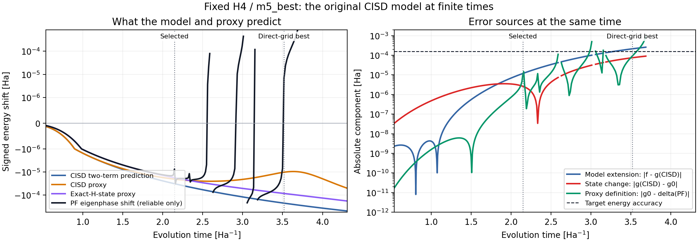

# H4：長い時刻の誤差原因と、入力状態だけを替えた選択の対照

実行日：2026-10-07。入力の確認snapshot：`869806ff9995b76ef2786ca7b57b9acc02c2731f`。

**短時間で観測した「状態置換が支配」という説明は、元のH4の長時間の過大予測にはそのまま当てはまらなかった。** 元の安い候補を除外した時刻では、モデルを長時間へ延ばした差が三成分のうち最大だった。状態をCISDから少し改善したCISDTへ替えると予測は大きく変わったが、選んだ長い時刻は元の枝同定条件を満たさず、精度は確認できなかった。厳密状態を入力したモデルでも同様であり、状態の改善だけでは長い時刻を信頼して選べるとは言えない。

これは、既に観測したH4条件について原因を確かめる追加対照である。新しい一般的方法の採択や独立holdoutの成功を示す結果ではない。元の凍結model、selection、budget、formal resultは変更していない。

## 条件と計算順序

ユーザーは2026-10-07に、追加検証の条件をCodexが判断して進めることと並列検証を明示承認した。[protocol.json](protocol.json)を新規計算前にfreezeし、予測を[predictions.json](predictions.json)と[PREDICTIONS_FROZEN.json](PREDICTIONS_FROZEN.json)へ保存してから、PF固有値による採点を行った。元の選択結果は既に知られているため、prospectiveな検証ではない。

| 項目 | 固定した条件 |
|---|---|
| Hamiltonian | 保存したH4直線鎖、原子間距離1.0 Å、STO-3G、4電子、α/β各2電子、36次元、13群 |
| PF | Yoshida4、current_m3、two_term_center、m5_bestの元の係数列 |
| 候補時刻 | 元のCISDで決めたPF別401絶対時刻。全状態で共通。範囲の拡大なし |
| fit時刻 | 各PFの元のCISD由来基準時刻の0.1/0.2/0.3/0.4/0.5倍。全状態で同じ5絶対時刻 |
| fit | 符号付き四次・六次の二項。切片なし、列スケーリング付き最小二乗。元の信号品質・条件数gateを維持 |
| 目標と費用 | ε = 0.00015936001019904 Ha、β = 1.2、一回の回転数1116/2556/2556/3996、予算 = 予測費用×1.01 |
| 状態 | 保存RHF、保存CISD、保存厳密H基底状態と、同じHamiltonianから作るCIS、CISDT |
| 新しいtruth | 元の全1604点を同じ枝追跡で再計算。厳密state proxyのspectral監査は固定3点のみ |
| 停止点 | 5状態×4PFの対照、全候補の三成分、元の長時間2点の接続、固定3点のspectral監査まで |

CISとCISDTは、保存されたRHFの電子配置からの励起rankがそれぞれ1以下、3以下の配置へHamiltonianを射影し、その最小固有状態を使う。厳密状態と人工的に混合して近づけた状態ではない。CISDのrank≤2の27配置は保存されたCISD配置と一致し、射影して求めた状態と保存CISDの重なりの二乗は数値精度内で1だった。

状態品質の厳密状態に対する重なり、エネルギー誤差等は対照の監査に使う。rankや選択規則を調整する入力にはしない。厳密状態モデルは、状態置換の影響を取り除くoracle対照である。

## 元の長い時刻で、三成分のどれが効いたか

同じPFと時刻で

$$
\widehat f_{\rm CISD}-\delta_P
=(\widehat f_{\rm CISD}-g_{\rm CISD})
+(g_{\rm CISD}-g_0)
+(g_0-\delta_P)
$$

を計算した。ここでは元の保存CISDモデルを一切変更しない。

| m5_bestの時刻［Ha⁻¹］ | モデル−CISD代理量 | CISD代理量−厳密代理量 | 厳密代理量−PF固有位相誤差 | 合計の予測差 |
|---|---:|---:|---:|---:|
| 2.1466061：元の選択 | −1.17776×10⁻⁵ | −2.62869×10⁻⁶ | −1.02286×10⁻⁵ | −2.46349×10⁻⁵ |
| 3.5175172：候補内の直接最小費用 | −2.13449×10⁻⁴ | +7.49961×10⁻⁵ | −9.22402×10⁻⁵ | −2.30693×10⁻⁴ |

すべて単位はHa。詳細は[long_time_bridge.csv](long_time_bridge.csv)。両点は元の枝信頼条件を満たす。



図は保存したscalarのみから作成した。左は符号付きの予測・代理量・PF誤差、右は三成分の絶対値。枝条件を満たさない点のPF誤差と、それを含む成分は表示しない。[PDF版](m5_error_components.pdf)も保存した。

2.1466では、モデルの差と代理量そのものの差が状態置換の差より大きい。3.5175ではモデルの差が最大で、状態置換と代理量の差は逆符号になり、部分的に相殺している。この時刻で元モデルが予測したPF誤差は約2.23717×10⁻⁴ Ha、直接誤差の絶対値は約6.97599×10⁻⁶ Haだった。**安い候補を除外した理由を、CISDへの置換だけで説明することはできない。** この三分解は符号付き予測差の恒等分解であり、非線形な費用差の割合を同じ比率へ分解したものではない。

## 状態を改善したとき、予測と選択はどう変わったか

保存された厳密H基底状態との重なりと、変分的な状態エネルギーの誤差は次の通り。このエネルギー誤差は状態品質の指標であり、PF固有位相から求める誤差とは別の量である。

| 状態 | CI配置数 | 基底状態との重なりの二乗 | 状態エネルギーの誤差［Ha］ |
|---|---:|---:|---:|
| RHF | 1 | 0.936463856 | 0.067841512 |
| CIS | 9 | 0.936463869 | 0.067841512 |
| CISD | 27 | 0.999466844 | 0.001355607 |
| CISDT | 35 | 0.999510331 | 0.001287331 |
| 厳密状態 | 36 | 1.000000000 | 数値精度内で0 |

このH4条件ではCISはRHFからほぼ変化せず、CISDTのCISDに対する品質改善も小さい。それでも、同じfit時刻で作る予測モデルと採用時刻は大きく変化した。

| 入力状態 | 予測で選んだPF・時刻［Ha⁻¹］ | 用意した予算［百万回転］ | 精度について確認できたこと |
|---|---|---:|---|
| RHF | two_term_center、1.8605783 | 10.524 | 信頼できる枝で不合格。PF誤差だけで目標を超えた |
| CIS | two_term_center、1.8605783 | 10.524 | 信頼できる枝で不合格。PF誤差だけで目標を超えた |
| CISD | m5_best、2.1466061 | 17.745 | 信頼できる枝で合格。合計誤差1.33466×10⁻⁴ Ha |
| CISDT | m5_best、4.3081172 | 7.172 | 採点不可。元のPF枝信頼条件を満たさない |
| 厳密状態 | m5_best、4.2194574 | 7.242 | 採点不可。元のPF枝信頼条件を満たさない |

枝信頼条件は、H基底状態および直前PF固有状態との重なりの二乗がそれぞれ0.9以上、固有対残差が10⁻¹⁰以下である。CISDTと厳密状態が選んだ点の追跡固有状態は、H基底状態との重なりが約0.0006だった。その追跡値を基底エネルギーの実際のPF誤差とは扱わず、合格／不合格から分離した。元のm5候補でこの条件を満たした最も長い点は3.6860036 Ha⁻¹だったが、それを用いて選び直す救済はしていない。

RHF/CISでは、選択点の直接PF誤差の絶対値は2.36979×10⁻⁴ Ha。QPE誤差を加える前から目標を超える。CISDでは、元の選択時刻を再現し、費用も相対差9.33×10⁻¹²以内で再現した。予算／候補内の直接最小費用は元と同じ約1.98352だった。

**CISDTと厳密状態の予算が小さくなった数値だけを、資源改善として数えない。** 精度を確認できることが前提である。判定の3分類は[classification_and_audit.json](classification_and_audit.json)に記録した。元の[allocations.csv](allocations.csv)の`target_met=False`は、枝条件不成立も含むため、そのfieldだけを使ってCISDTや厳密状態を精度不合格と説明しない。

全状態を同じm5・同じ時刻で比べると、状態品質と代理量のずれも一対一には対応しなかった。2.1466では状態置換差がCISDの−2.62869×10⁻⁶からCISDTの+9.06358×10⁻⁸へ小さくなった。一方、3.5175ではCISDの+7.49961×10⁻⁵に対し、CISDTは+8.08721×10⁻⁵となり、少し大きくなった。詳細は[state_decomposition_grid.csv](state_decomposition_grid.csv)。この一条件の対照だけから、状態品質を上げれば必ず改善する、あるいは改善しない、という一般的な単調性は結論しない。

厳密状態モデルでも、3.5175ではfitの差+3.20654×10⁻⁵と代理量の差−9.22402×10⁻⁵が残り、合計の予測差は−6.01747×10⁻⁵ Haだった。状態置換差は0である。これは、予測の問題が近似状態だけではないことを、同じ時刻で確かめた対照である。

## 厳密状態でも代理量がPF固有位相誤差と違う理由

厳密なH基底状態をPF固有状態へ展開すると、

$$
g_0(t)=\sum_j w_j(t)\frac{\sin[\theta_j(t)-E_0t]}{t},
\qquad w_j=|\langle v_j(t)|\psi_0\rangle|^2
$$

となる。目的のPF固有枝だけでなく、それ以外のPF固有状態も代理量へ寄与する。[spectral_protocol.json](spectral_protocol.json)を別にfreezeし、元の信頼できるm5の3点で、この和と直接計算した代理量の一致を調べた。

| 時刻［Ha⁻¹］ | 目的のPF固有枝の重み | 目的の枝の代理量への寄与［Ha］ | その他の枝の寄与の和［Ha］ | 厳密状態の代理量［Ha］ |
|---|---:|---:|---:|---:|
| 0.4 | 0.999999999999 | −2.87094×10⁻⁸ | +1.73056×10⁻¹² | −2.87077×10⁻⁸ |
| 2.1466061 | 0.999072126 | −7.57058×10⁻⁶ | −1.02357×10⁻⁵ | −1.78062×10⁻⁵ |
| 3.5175172 | 0.998553931 | +6.96590×10⁻⁶ | −9.22301×10⁻⁵ | −8.52642×10⁻⁵ |

3.5175では、目的のPF固有枝の重みが約0.99855と大きくても、残り約0.00145の重みが代理量へ大きく寄与し、符号を変えた。`sin(tδ)/t−δ`というsinの非線形性の差は約−7.00×10⁻¹⁶ Ha、重みの損失による差は約−1.01×10⁻⁸ Haであり、主な差は**他のPF固有状態の寄与**だった。2.1466でも同じ種類の影響を確認した。

これは、入力状態を厳密H基底状態にしても、その状態が有限時間のPF固有状態とは一致しないことによる。この3点の計算は、代理量とPF固有位相誤差を区別する理由を具体化する。代理量を新しい推定法へ置き換えた結果ではない。108個の固有成分の重み・位相・寄与は[spectral_components.csv](spectral_components.csv)、要約とclosureは[spectral_proxy_summary.csv](spectral_proxy_summary.csv)に残した。

## 確認できたことと限界

- 長い時刻の元CISDの予測差は、モデル、状態、代理量の三成分を同じ点で揃えて説明できた。3.5175の最大成分はモデルの延長による差であり、短時間の状態支配から原因を決める説明を修正できる。
- CISDより改善したCISDTと、厳密状態の対照を追加した。状態だけを替えると予測と選択が変わるが、今回選ばれた長い時刻の精度確認には至らなかった。
- 厳密状態からの代理量と、目的のPF固有位相誤差の差は、固定3点で主に他のPF固有状態の寄与によると確認できた。
- 対象は元のH4条件、4PF、元の候補範囲である。状態・PF・時刻の選び方を最適化した一般的な方法、別分子への保証、範囲外の最適性は示していない。
- 状態生成、Hamiltonianの正確な時間発展、古典計算の費用は、量子回転の予算に含めていない。CISDTや厳密状態が実用的に安価に準備できることは主張しない。

## 数値確認と再現

[checks.json](checks.json)に、元の全1604点の直接shiftとの最大差0、最大固有対残差1.03×10⁻¹³、最大unitarity残差8.79×10⁻¹³、三成分closure残差2.78×10⁻¹⁷を記録した。m5の0.4 Ha⁻¹における保存proxyの再現差は、CISDで1.79×10⁻¹⁷、厳密状態で0 Ha。spectral和の最大closure残差は5.45×10⁻¹⁵ Haだった。元候補1604点のうち49点は枝信頼条件を満たさず、基準費用と精度判定から除外する。

新規PF固有値計算は候補1604点とspectral監査3点の計1607回。proxyは全候補5状態×1604＝8020値、fitとrepeat計200値、短時間再現5値、spectral3点×5状態＝15値を計算した。proxy計算のためにPF unitaryはfitのrepeatを含め1648回構築した。全1604点の採点は、BLAS/OpenMP各1スレッドで約6.4秒だった。新しいmatrix、vector、unitary、exact stateはartifactへ書き出していない。

コードは[状態対照runner](../../review_response/run_lab_progress_h4_state_checks_20261007.py)、[spectral監査runner](../../review_response/audit_lab_progress_h4_spectral_proxy_20261007.py)、[保存結果監査](audit_results.py)、[保存scalarの作図](plot_saved_results.py)。実行順は次の通り。

```bash
export OMP_NUM_THREADS=1 MKL_NUM_THREADS=1 OPENBLAS_NUM_THREADS=1
export MPLCONFIGDIR=/tmp/lab-progress-h4-mpl
export PYTHONPATH=src:.
python -m review_response.run_lab_progress_h4_state_checks_20261007 --phase freeze
python -m review_response.run_lab_progress_h4_state_checks_20261007 --phase predict
python -m review_response.run_lab_progress_h4_state_checks_20261007 --phase score
python -m review_response.audit_lab_progress_h4_spectral_proxy_20261007 --phase freeze
python -m review_response.audit_lab_progress_h4_spectral_proxy_20261007 --phase run
python artifacts/lab_progress_h4_state_checks_20261007/plot_saved_results.py
python artifacts/lab_progress_h4_state_checks_20261007/audit_results.py
```

既存のfreeze済みdirectoryには再freezeできない。数値runnerの再実行時は`--output /tmp/任意の新しいdirectory`を使う。保存結果監査と作図は、このartifact directoryのscalarを読む。数値環境はPython 3.11.1、NumPy 1.26.4、SciPy 1.14.1。実際のPythonは`/home/abe/myproject/Evaluation_numGate_highorder/.venv-req/bin/python`を使った。

元資料の`origin_result_commit`と`verified_snapshot_commit`は[protocol.json](protocol.json)のsource registryで別fieldとして保持した。新規のコード・scalar・文書のSHA-256は[manifest.json](manifest.json)に記録し、manifest自体の自己除外を明示する。新規結果の公開commitは親の統合handoffで記録する。
