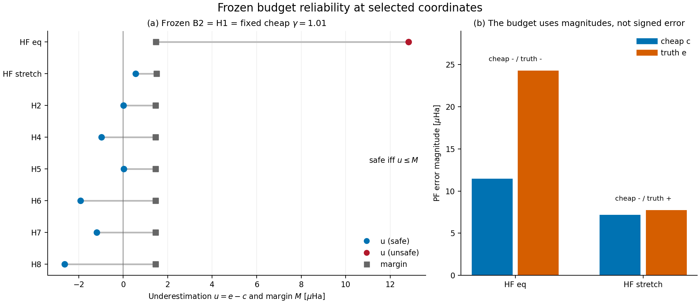
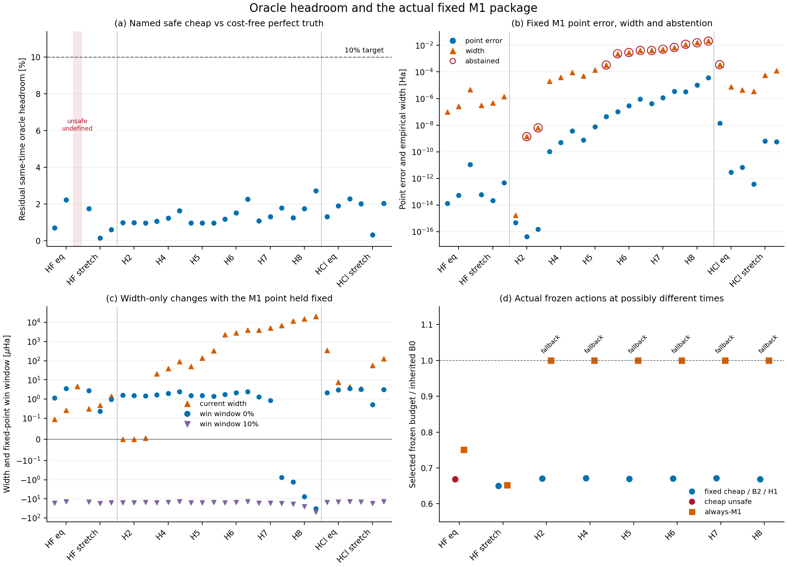
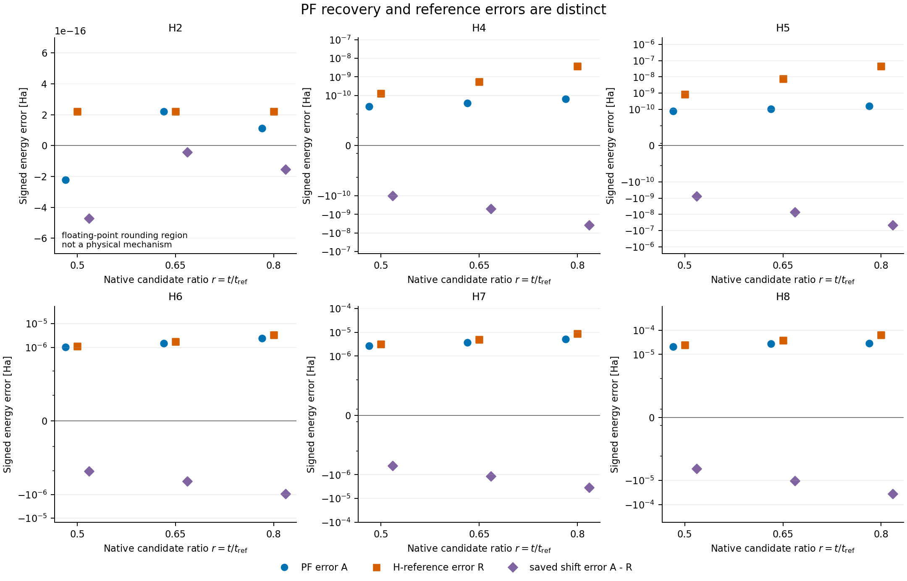

# 第2研究の主図説明

各画像はPNG、SVG、PDFの3形式で[figures](figures)にある。
数値sourceは[registry](../../docs/second_study_v2/result_synthesis_20261005/source_registry.json)、
個々のmarkのsource rowは[figure data](figures/figure_data.json)へ対応する。
英語ラベルはportable font、日本語captionは本書で提供する。

## Figure 1 凍結予算の過小評価と吸収可能余裕

(a) HF2条件の1.6T0とH2/H4/H5/H6/H7/H8のr=.8で、保存B2/H1とfixed cheap gamma1.01が同じactionだった8条件を示す。
丸はu=e-c、四角は固定予算が吸収可能なM=(1-1/gamma)*(epsilon_E-c)。
線は同じconditionの量を結ぶだけでfitではない。u<=Mなら指定continuous budgetはnumerical truth上safe。
青丸はsafe、赤丸はunsafeで、負のuはcheap magnitudeの過大評価を意味する。
HF eqはu=12.8300 microhartree、M=1.46426 microhartreeでunsafe。
(b) Budgetに入るc=abs(delta_C)とe=abs(delta_direct)をHF選択点で比較する。
Stretchのcheap/truthは符号が逆だが絶対値不足は0.563019 microhartreeでmargin内だった。
Signed精度の一般的不要性ではなく、uncorrected taskで何がbudget safetyを決めるかの比較である。
全8条件でq=0、H1のconditional spectral pathは評価していない。gamma1のratioは図示しない。

Sourceはbudget_safety_capacity.csvとselected_frozen_budget_safety.csv。
HClのselector、holdout安全率、新gateはこの図から主張しない。

## Figure 2 Oracle余地と固定M1の実際の制約

(a) 10 native条件の各3候補をtime昇順で示す。各groupの横軸labelはconditionを表し、
候補比率はHFで1,1.3,1.6 T0、H-chain/HClで.5,.65,.8 t_ref/t_ana。
HF/H-chainは同時刻fixed cheap gamma1.01、HClはmain同時刻gamma1.02を対照とする。
安全な参照から無償の完全truth floorへ残る削減率はHF5/6で0.1506–2.2428%、
H-chain18/18で0.9766–2.7290%、HCl6/6で0.3280–2.2865%。
Unsafe HF eq1.6T0は未定義で、赤いshadeは欠測位置を示すだけで0%ではない。
破線は元の10% targetであり、これらの名指しsafe同時刻比較では完全truthでも届かない。
29比較を29 independent samplesとは数えず、別時刻/PF/gamma/correctionへ一般化しない。

(b) M1 signed-shift point errorの絶対値と保存empirical widthをlog表示する。
赤いringは元のabstentionで、rank不足やpositive QPE allowance不足を救済しない。
30点の経験的coverageを数学的certificateや未知条件のcoverage保証としない。
(c) Widthと、固定M1 pointを保持した0%/10% width-only win windowを符号付きsymmetric-logで表示する。
横線は0。対照がunsafeならwindowは表示しない。負のwindowをゼロにしない。
Panel aのperfect-truth floorはpointもtruthへ置き換える比較なので、panel cとは違う。

(d) HF2条件とH-chain6系の保存selected budgetをそれぞれのB0で正規化する。
青/赤丸はfixed1.01=B2=H1、橙四角はalways-M1の**最終action**。
Cheap unsafeを赤で残し、安いから成功とは解釈しない。
H-chainのM1は全6系でB0 fallback、HF M1はcap外候補を採用した。
ここでは同時刻とは限らず、panel a,cのheadroomへこの比率を混ぜない。
HClは同じselector contractを持たないのでpanel dへ追加しない。
H-chain元3候補oracleは全6系でr=.8だが連続時刻最適値ではない。

Sourcesはsame_time_oracle_headroom.csv、oracle_headroom_by_contract.csv、
m1_point_width_abstention.csv、width_decision_windows.csv、selected_frozen_budget_safety.csv。
Method全般ではなく固定M1 packageの評価であり、情報そのものの価値が負とする原理ではない。

## Figure 3 PF固有値側とHamiltonian参照側の誤差

Same-H、sector、energy origin、physical liftを確認できたH-chain18点について、
青丸A=Ehat_PF-E_PF、橙四角R=Ehat_H-E0、紫diamondの保存shift errorを並べる。
浮動小数点closureを別途監査した上でshift error=A-Rとして解釈する。
横位置の小offsetはmark識別のためで、科学時刻の追加ではない。

H4/H5ではreference側がPF側より大きく、H6/H7/H8では正の二成分が部分相殺する。
Panelごとのsymmetric-log軸は符号を保持する表示設定で、同じvertical distanceを同じ倍率とはみなさない。
H2だけはlinearで1e-16級の丸め域を表示し、物理的機構と解釈しない。
HF/HCl12点の欠測はゼロやH-reference由来targetで補完していない。
誤差相殺原理の新規性、state/rankの因果原因、厳密ground/branch認証は主張しない。

Sourceはm1_reference_error_decomposition.csvのverified-status18行。
図は実際に使ったprimary prefix（rank-reducedを含む）を保持している。
